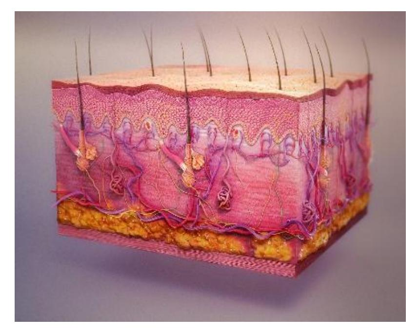

# **Integumentary System**

**Figure 5.1** The Integumentary System.

## **Course Objectives**

At the conclusion of this lab, you should be able to:

-   Describe the structure of the skin.
-   Describe the functions of the integumentary system.
-   Differentiate between the layers of the epidermis.
-   Identify the components of the dermis and their function.
-   Identify layers of the integumentary system on a model or diagram.
-   Identify and describe the function of integumentary structures.

------------------------------------------------------------------------

## **Prelab Activity 5.1**

### **Epidermal Layer**

| Term | Definition |
|----|----|
| Epidermis | Outermost skin layer made of keratinized stratified squamous epithelium |
| Stratum corneum | Superficial layer of dead keratinized cells |
| Stratum lucidum | Clear layer found only in thick skin |
| Stratum granulosum | Keratinization begins |
| Stratum spinosum | Provides strength and flexibility |
| Stratum basale (germinativum) | Deepest epidermal layer; mitosis occurs |
| Dermal layer | Layer beneath epidermis composed of connective tissue |

### **Dermal Layer**

| Term | Definition |
|----|----|
| Dermis | Connective tissue layer containing glands, vessels, and nerves |
| Papillary layer | Superficial layer of areolar connective tissue |
| Reticular layer | Deep layer of dense irregular connective tissue |

| Term | Definition |
|----|----|
| Subcutaneous layer (Hypodermis) | Anchors skin to underlying tissues; fat storage |

### **Integumentary Structures**

| Term                  | Definition                                         |
|-----------------------|----------------------------------------------------|
| Dermal papillae       | Increase surface area between epidermis and dermis |
| Hair shaft            | Portion of hair above skin                         |
| Hair root             | Portion below skin                                 |
| Hair follicle         | Tube that surrounds hair root                      |
| Pore                  | Opening for sweat                                  |
| Arrector pili muscle  | Raises hair                                        |
| Sebaceous gland       | Produces sebum                                     |
| Merocrine sweat gland | Thermoregulation                                   |
| Apocrine sweat gland  | Produces thicker sweat                             |
| Free nerve ending     | Pain and temperature                               |
| Meissner’s corpuscle  | Light touch                                        |
| Pacinian corpuscle    | Pressure                                           |
| Keratinocyte          | Produces keratin                                   |
| Melanocyte            | Produces melanin                                   |

------------------------------------------------------------------------

## **Prelab Activity 5.2**

### **Label the Layers**

-   4: Epidermis\
-   5: Dermis\
-   6: Hypodermis

### **Accessory Structures**

-   15: Hair follicle\
-   21: Pacinian corpuscle\
-   14: Sebaceous gland\
-   20: Merocrine (eccrine) sweat gland

------------------------------------------------------------------------

## **Table 5.1 – Epidermal Layers**

| Layer              | Major Features         |
|--------------------|------------------------|
| Stratum corneum    | Protection, waterproof |
| Stratum lucidum    | Thick skin only        |
| Stratum granulosum | Keratin formation      |
| Stratum spinosum   | Desmosomes             |
| Stratum basale     | Cell division          |

------------------------------------------------------------------------

## **Lab Activity 5.4 – Dermal Structures and Functions**

| Structure            | Function           |
|----------------------|--------------------|
| Dermal papillae      | Nutrient diffusion |
| Pore                 | Releases sweat     |
| Arrector pili muscle | Goosebumps         |
| Sebaceous gland      | Lubricates skin    |
| Merocrine gland      | Cooling            |
| Apocrine gland       | Scent              |
| Free nerve ending    | Pain               |
| Meissner’s corpuscle | Touch              |
| Pacinian corpuscle   | Pressure           |
| Keratinocyte         | Keratin production |
| Melanocyte           | UV protection      |

------------------------------------------------------------------------

## **Post Lab Activity 5.1**

-   **Layers of the dermis:** Papillary; Reticular\
-   **Major glands:** Sebaceous, eccrine, apocrine\
-   **Protective functions:** Barrier, UV protection, water retention

------------------------------------------------------------------------

## **Post Lab Activity 5.4 – Check Your Understanding**

**Layers cut (superficial to deep):**\
Epidermis → Dermis → Hypodermis

**Orange skin condition:**\
Dietary carotene accumulation (harmless).

**Thermoregulation:**\
Sweating and vasodilation.

**Melanoma risk:**\
Reduced melanin increases UV damage.

------------------------------------------------------------------------

## **Post Lab Activity 5.6**

**Skin epithelium:**\
Keratinized stratified squamous epithelium

**Five epidermal layers (thick skin):** - Stratum corneum\
- Stratum lucidum *(absent in thin skin)*\
- Stratum granulosum\
- Stratum spinosum\
- Stratum basale

**Functions of integumentary system:** - Protection\
- Temperature regulation\
- Sensation\
- Vitamin D synthesis
